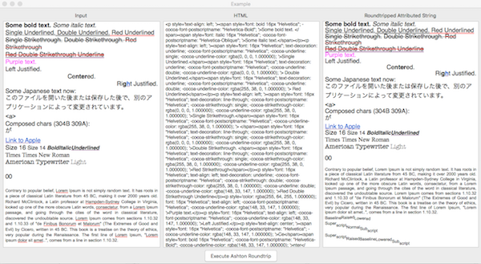

# Ashton 

[](https://swift.org/package-manager/)
[](https://github.com/Carthage/Carthage)


[](LICENSE.md)
[](https://buildkite.com/ideasoncanvas/ashton)
[](https://twitter.com/_mschwarz_)

Ashton (<b>A</b>ttributed<b>S</b>tring<b>H</b>TML<b>T</b>ransformati<b>on</b>) is an iOS, macOS, and visionOS library for fast conversion of NSAttributedStrings into HTML, and back. Ashton is battle-tested and used in [MindNode](https://mindnode.com), for persisting formatted strings.

## 2.0 Release

The latest release is a complete rewrite in Swift focusing on improved performance and functional backwards compatibility to Ashton 1.x. The new codebase has a comprehensive test suite with a test coverage of > 90% and additional tests against the legacy 1.0 output. 

Find out more about the launch of Ashton 2.0 in our [Blog Post](https://mindnode.com/news/2019-04-10-a-snappier-mindnode-text-persistence).

## Supported Attributes

The following `NSAttributedString.Key` attributes are supported, when converting to `HTML`:
- [x] .backgroundColor (persisted as RGBA)
- [x] .foregroundColor (persisted as RGBA)
- [x] .underlineStyle (single, double, thick)
- [x] .underlineColor (persisted as RGBA)
- [x] .strikethroughColor (persisted as RGBA)
- [x] .strikethroughStyle (single, double, thick)
- [x] .font
- [x] .paragraphStyle (text alignment)
- [x] .baselineOffset
- [x] NSSuperScript
- [x] .link

## Supported HTML Tags & Attributes

As Ashton supports only tags which are necessary to persist the attributes mentioned above, not all HTML tags are supported when converting `HTML` --> `AttributedString`. Basically, Ashton converts an AttributedString into a concatenation of `span`, `p` and `a` tags with style attributes. 

Supported HTML Tags:
- [x] span
- [x] p
- [x] a
- [x] em
- [x] strong

The following style attribute keys are supported:
- [x] background-color
- [x] color
- [x] text-decoration
- [x] font
- [x] text-align
- [x] vertical-align
- [x] Additional custom attributes (-cocoa-strikethrough-color, -cocoa-underline-color, -cocoa-baseline-offset, -cocoa-vertical-align, -cocoa-font-postscriptname, -cocoa-underline, -cocoa-strikethrough, -cocoa-fontFeatures)

Colors have to be formatted as rgba like `rgba(0, 0, 0, 1.000000)`.

## Integration

### Carthage

Add this line to your Cartfile.
```
github "IdeasOnCanvas/Ashton"
```

### Integration with the Swift Package Manager

The Swift Package Manager is a dependency manager integrated with the Swift build system. To learn how to use the Swift Package Manager for your project, please read the [official documentation](https://github.com/apple/swift-package-manager/blob/master/Documentation/Usage.md).  
To add ZIP Foundation as a dependency, you have to add it to the `dependencies` of your `Package.swift` file and refer to that dependency in your `target`.

```swift
// swift-tools-version:5.1
import PackageDescription
let package = Package(
    name: "<Your Product Name>",
    dependencies: [
		.package(url: "https://github.com/IdeasOnCanvas/Ashton/", .upToNextMajor(from: "2.0.0"))
    ],
    targets: [
        .target(
		name: "<Your Target Name>",
		dependencies: ["Ashton"]),
    ]
)
```

After adding the dependency, you can fetch the library with:

```bash
$ swift package resolve
```

## Usage

### Encode HTML

```swift
let htmlString = Ashton.encode(attributedString)
```

### Decode NSAttributedString

```swift
let attributedString = Ashton.decode(htmlString)
```

## Example App

An example app can be found in the `/Example` directory. It can be used to test `NSAttributedString` -> HTML -> `NSAttributedString` roundtrips and also to extract the HTML representation of an `NSAttributedString.




## Credits

Ashton is brought to you by [IdeasOnCanvas GmbH](https://ideasoncanvas.com), the creator of [MindNode for iOS, macOS & watchOS](https://mindnode.com).
